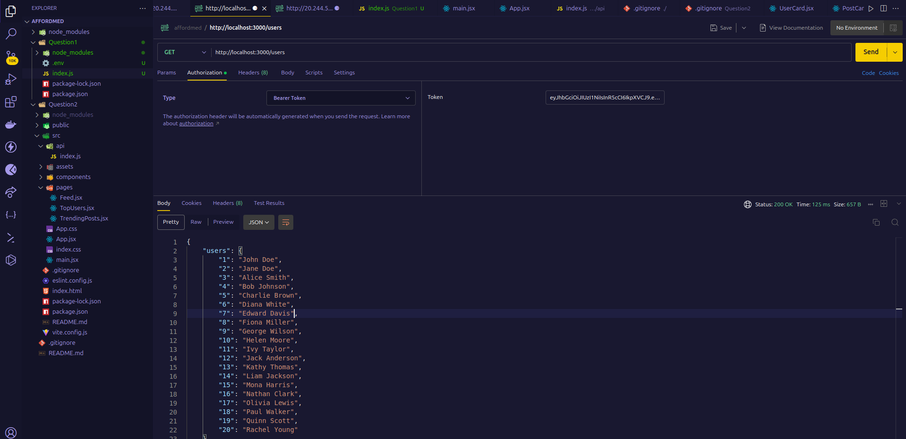
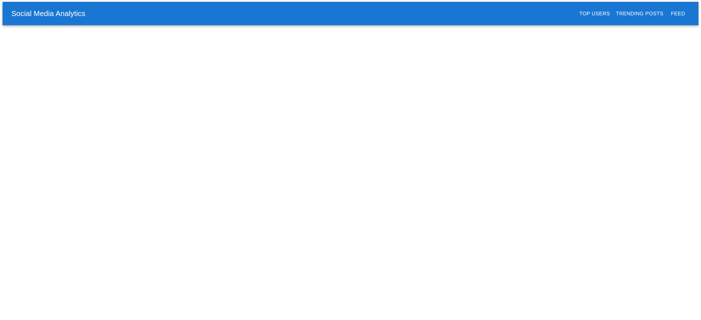

# Social Media Analytics

## Description

This project consists of two main parts:

- **Backend**: An API server that fetches and serves data related to users and posts from an external service.
- **Frontend**: A React-based web app that fetches data from the backend and displays posts and user analytics.

## Project Structure

- **Backend**: Runs on port `8000`.
- **Frontend**: Runs on port `3000`.

---

## Backend (API Server) - Port 8000

### 1. **Environment Setup**

- Install dependencies:
  ```bash
  npm install

  



